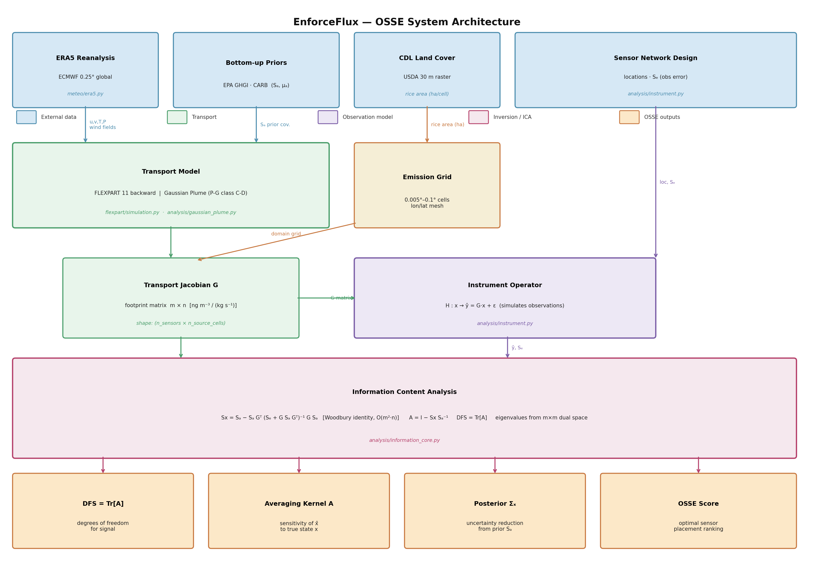

# EnforceFlux

EnforceFlux is a modular OSSE (Observing System Simulation Experiment) framework for evaluating methane monitoring systems. It combines ERA5 meteorological reanalysis, Lagrangian particle dispersion (FLEXPART) or Gaussian plume transport, a Bayesian inversion pipeline, and satellite data tools to answer: *how well can a proposed sensor network attribute emissions to specific sources?*



---

## Contents

- [Installation](#installation)
- [Capabilities](#capabilities)
- [Apps](#apps)
- [Compiling FLEXPART](#compiling-flexpart)
- [ERA5 meteorological forcing](#era5-meteorological-forcing)
- [Methane Transport Simulation](#methane-transport-simulation)
  - [Quick start](#quick-start-simulation)
  - [YAML config reference](#yaml-config-reference)
- [OSSE Pipeline](#osse-pipeline)
- [Repo layout](#repo-layout)
- [Testing](#testing)

---

## Installation

Python 3.10 or later is required.

```bash
python3 -m venv .venv
source .venv/bin/activate
pip install -e '.[dev]'
```

This installs the package in editable mode and registers all built-in plugins.

**Optional extras:**

```bash
pip install -e '.[meteo]'     # ERA5 download — cdsapi, eccodes
pip install -e '.[analysis]'  # plotting + geospatial figures — matplotlib, scipy,
                              #   xarray, pandas, rasterio, cartopy, shapely
pip install -e '.[dev]'       # tooling — pytest, pytest-cov, ruff, mypy
pip install -e '.[all]'       # everything above
```

**Or use the Makefile** (creates `.venv`, installs all extras, then clones and
compiles FLEXPART):

```bash
make env && source .venv/bin/activate
make install        # pip install -e ".[all]"  +  FLEXPART build
make test           # pytest (skips flexpart_integration by default)
make figures        # regenerate the single-source OSSE figures
```

**System dependencies** (required for FLEXPART and ERA5):

```bash
# macOS
brew install gcc eccodes netcdf netcdf-fortran

# Linux
sudo apt-get install gfortran libeccodes-dev libnetcdf-dev libnetcdff-dev
```

---

## Capabilities

| Capability | Description |
|---|---|
| **Transport — FLEXPART** | Lagrangian backward-mode footprint computation using FLEXPART 11. Releases particles from sensor locations; footprint encodes emission sensitivity per source cell. Best for regional (10–500 km) domains with WRF or ERA5 met. |
| **Transport — Gaussian plume** | Analytical Pasquill-Gifford dispersion (class C-D). Builds the full G Jacobian in milliseconds. Ideal for sub-km single-source scenarios and rapid OSSE sweeps. |
| **ERA5 downloader** | Downloads ECMWF ERA5 reanalysis (pressure-level + single-level + fluxes) via CDS API and reformats to FLEXPART-ready GRIB files with an `AVAILABLE` index. |
| **Instrument operator** | Models open-path (OP), point-sensor (PT), and remote-sensing (RS) instruments. Applies per-technology noise (Sₑ) and generates simulated observations ŷ = G·x + ε. |
| **Bayesian inversion** | Computes optimal posterior x̂ = μₐ + Sₐ Gᵀ (Sₑ + G Sₐ Gᵀ)⁻¹ (y − G μₐ). |
| **Information content analysis** | Woodbury-accelerated (O(m²·n)) computation of posterior covariance Sₓ, averaging kernel A, DFS = Tr[A], and dual-space eigenspectrum. Scales to 10,000+ source cells. |
| **Sensor ablation study** | Incremental and leave-one-out sensor ranking by DFS contribution. |
| **Sacramento Valley OSSE** | Multi-source, multi-instrument OSSE over Central Valley using April and July 2020 meteorology. Benchmarks 3-sensor OP networks against 1–5 sensor configurations. |
| **Bottom-up inventory analysis** | Loads EPA GHGI gridded CH4 and USDA CDL 30 m land cover; computes per-cell rice emission factors; compares EPA GHGI vs. CARB vs. IPCC reference ranges. |
| **TROPOMI analysis** | Grids Sentinel-5P XCH4 retrievals; computes seasonal anomaly maps (rice season minus fallow); performs valley-scale enhancement detection. |

---

## Apps

The `apps/` directory contains end-to-end pipeline scripts driven by YAML configs. Run any app from the repo root with `python apps/<script>.py --config apps/<config>.yaml`.

### `met_main.py` — ERA5 downloader
Downloads ERA5 for a specified date range and geographic bounding box. Outputs FLEXPART-ready GRIB files and an `AVAILABLE` index.

```bash
python apps/met_main.py --config apps/met_main.yaml
```

### `simulation_main.py` — Forward FLEXPART simulation
Runs a forward CH4 transport simulation: point and/or diffuse sources → gridded concentration field → NetCDF. Useful for visualizing how methane from a given source pattern spreads over a domain.

```bash
python apps/simulation_main.py --config apps/simulation_main.yaml
```

### `flux_main.py` — Flux inversion
Runs the full inversion pipeline: loads a pre-computed G matrix + prior emissions → Bayesian posterior → flux estimates with uncertainty. Outputs posterior flux maps and uncertainty reduction statistics.

```bash
python apps/flux_main.py --config apps/flux_main.yaml
```

### `analysis_main.py` — Information content analysis
Takes an existing transport Jacobian G and sensor configuration and computes DFS, averaging kernel, posterior covariance, and sensor ablation rankings.

```bash
python apps/analysis_main.py --config apps/analysis_main.yaml
```

### `instrument_main.py` — Instrument OSSE
Single-source instrument sensitivity experiment. Builds an analytical Gaussian-plume G for a configurable sensor network, runs the full information content analysis, and generates diagnostic figures (footprints, DFS spatial map, posterior uncertainty, sensor ablation).

```bash
python apps/instrument_main.py --config apps/instrument_main.yaml
```

### Examples

Standalone demo scripts live in `examples/`:

| Script | Description |
|---|---|
| `single_source_instrument_demo.py` | 3-sensor open-path network, 500 m from a point source. Gaussian plume G, Woodbury ICA. |
| `sacramento_valley_2020.py` | Multi-source Sacramento Valley OSSE; April vs. July met comparison. |
| `gaussian_plume_single_source_demo.py` | Minimal Gaussian plume forward simulation with 1 source. |
| `osse_25kg_leak_demo.py` | OSSE for a 25 kg hr⁻¹ leak detection scenario. |

---

## Compiling FLEXPART

FLEXPART must be compiled from source before any Lagrangian transport simulation can run. The binary lives at `flexpart/src/FLEXPART` after a successful build.

### System dependencies

**macOS (Homebrew):**

```bash
brew install gcc eccodes netcdf netcdf-fortran
```

**Linux (apt):**

```bash
sudo apt-get install gfortran libeccodes-dev libnetcdf-dev libnetcdff-dev
```

### Build environment

On macOS set these before building (add to your shell profile to make them permanent):

```bash
export CPATH="/opt/homebrew/include:$(brew --prefix eccodes)/include:$(brew --prefix netcdf)/include:$(brew --prefix netcdf-fortran)/include"
export LIBRARY_PATH="/opt/homebrew/lib:$(brew --prefix eccodes)/lib:$(brew --prefix netcdf)/lib:$(brew --prefix netcdf-fortran)/lib"
```

### Build

```python
from enforceflux.flexpart import FlexpartCompiler

compiler = FlexpartCompiler()
result = compiler.build(jobs=4)   # parallel make
print(result.executable)          # → …/flexpart/src/FLEXPART
```

Or from the command line:

```bash
python - <<'PY'
from enforceflux.flexpart import FlexpartCompiler
FlexpartCompiler().build(jobs=4)
PY
```

`FlexpartCompiler` automatically patches the upstream makefile to remove x86-specific flags (`-mcmodel=large`, `-march=native`) that do not compile cleanly on Apple Silicon, and pre-populates `gitversion.txt` so the GNU `sed -i` rule is not needed.

### Runtime environment

```bash
ulimit -s unlimited
export OMP_PLACES=cores
export OMP_PROC_BIND=true
export OMP_NUM_THREADS=4
```

Pass these in the transport config `env` field when driving FLEXPART from Python.

### Verify

```bash
pytest -q                              # full suite
pytest -q -m flexpart_integration     # binary smoke test only
```

---

## ERA5 meteorological forcing

FLEXPART is a **driven** model — it needs meteorological wind, temperature, and humidity fields to advect particles. ERA5 reanalysis from the Copernicus Climate Data Store (CDS) is the standard input.

### One-time setup

```bash
pip install -e '.[meteo]'     # adds cdsapi + eccodes to the venv
```

Register at <https://cds.climate.copernicus.eu/> and create `~/.cdsapirc`:

```
url: https://cds.climate.copernicus.eu/api
key: <your-uid>:<your-api-key>
```

### Download ERA5

```python
from enforceflux.meteo import ERA5Downloader

dl = ERA5Downloader(output_dir="inputs/meteo", timestep_hours=3)

result = dl.download(
    start="2020-06-15T00:00",
    end="2020-06-15T18:00",
    bbox=(-124, 36, -118, 41),   # (lon_min, lat_min, lon_max, lat_max)
)

print(result.available_file)     # inputs/meteo/AVAILABLE
```

Point the simulation config at the downloaded data:

```yaml
flexpart:
  meteo_dir: inputs/meteo
  available_file: inputs/meteo/AVAILABLE
```

### What gets downloaded

Three CDS requests per calendar day:

| Request | CDS dataset | Variables |
|---------|-------------|-----------|
| Pressure levels | `reanalysis-era5-pressure-levels` | u, v, T, q, cloud water/ice, cloud fraction — 16 levels 1000–10 hPa |
| Single levels (analysis) | `reanalysis-era5-single-levels` | 10 m winds, 2 m T/Td, MSLP, surface pressure, BLH, SST, cloud cover |
| Single levels (fluxes) | same dataset | precipitation, surface heat fluxes, momentum flux (accumulated) |

A fourth request downloads time-invariant fields (land-sea mask, orography) on the first run; reused thereafter. Downloads are skipped when the output file already exists.

---

## Methane Transport Simulation

`FlexpartSimulation` is a standalone forward-simulation wrapper. It accepts a YAML config, writes all FLEXPART input files, executes the model, and converts gridded output to a clean NetCDF file.

Two source types are supported:

- **Point sources** — single-location releases (landfills, well pads, dairies). Rate in kg s⁻¹.
- **Diffuse sources** — area emissions (rice paddies, wetlands). Flux in kg m⁻² s⁻¹. The bounding box is subdivided into a lat/lon grid; per-cell mass uses cosine-latitude spherical area correction.

### Quick start (simulation)

```python
from enforceflux.flexpart import FlexpartSimulation

sim = FlexpartSimulation.from_yaml("examples/simulation_config.yaml")
output_nc = sim.run()   # returns path to output NetCDF
```

### YAML config reference

A fully-annotated example lives at [`examples/simulation_config.yaml`](examples/simulation_config.yaml).

#### `flexpart` — binary and directories

| Key | Type | Description |
|-----|------|-------------|
| `executable` | path | Path to the compiled `FLEXPART` binary. Required. |
| `options_dir` | path | Directory containing FLEXPART input templates. Required. |
| `available_file` | path | Path to the `AVAILABLE` meteorological index. Required. |
| `meteo_dir` | path | Directory containing ERA5 GRIB files. Required. |
| `run_dir` | path | Working directory. Recreated on every `run()`. Default: `runs/simulation`. |

#### `simulation` — timing

| Key | Type | Default | Description |
|-----|------|---------|-------------|
| `start` | ISO-8601 | — | UTC simulation start. |
| `end` | ISO-8601 | — | UTC simulation end. |
| `output_step_seconds` | int | `3600` | Output write interval (s). |
| `sync_seconds` | int | `900` | FLEXPART internal sub-step (must divide `output_step_seconds`). |

#### `domain` — output grid

| Key | Type | Default | Description |
|-----|------|---------|-------------|
| `lon_min/max` | float | — | Western/eastern boundary (degrees). |
| `lat_min/max` | float | — | Southern/northern boundary (degrees). |
| `dx` / `dy` | float | `0.1` | Longitude/latitude grid spacing (degrees). |
| `heights_m` | list | `[100, 500, 1000]` | Vertical layer upper boundaries (m AGL). |

#### Sources

```yaml
# Point source
- type: point
  id: landfill_A
  lon: -121.50
  lat:  38.60
  alt_m: 5.0
  emission_rate_kg_s: 2.0e-4
  n_particles: 10000

# Diffuse source
- type: diffuse
  id: rice_paddies_cv
  lon_min: -122.0
  lon_max: -121.0
  lat_min:  38.5
  lat_max:  39.5
  alt_m: 2.0
  emission_flux_kg_m2_s: 1.4e-9
  cell_size_deg: 0.1
  n_particles_per_cell: 500
```

---

## OSSE Pipeline

The information content analysis is the core of the OSSE:

```python
from enforceflux.analysis.information_core import analyze_information_content_spatial

result = analyze_information_content_spatial(G, Se, Sa, obs_groups, source_names)
print(f"DFS = {result['dfs_total']:.2f}")
print(f"Posterior uncertainty reduction: {result['uncertainty_reduction_pct']:.1f}%")
```

Key outputs:

| Field | Shape | Description |
|-------|-------|-------------|
| `dfs_total` | scalar | Total degrees of freedom for signal = Tr[A] |
| `dfs_per_sensor` | (m,) | DFS contribution of each sensor |
| `averaging_kernel` | (n,) | Diagonal of A (1D when spatial) |
| `posterior_variance` | (n,) | Diagonal of Sₓ |
| `uncertainty_reduction` | (n,) | 1 − √(Sₓᵢᵢ / Sₐᵢᵢ) per source cell |
| `eigenvalues` | (m,) | Eigenvalues of the m×m dual-space Fisher matrix |

---

## Repo layout

```
src/enforceflux/
    flexpart/
        simulation.py       # YAML-driven forward simulation
        build.py            # FlexpartCompiler — patches makefile, runs make
        runner.py           # FlexpartRunner — backward-mode G-matrix runs
    meteo/
        era5.py             # ERA5Downloader — CDS fetch + AVAILABLE writer
    analysis/
        information_core.py # Woodbury ICA: DFS, averaging kernel, posterior Σ
        instrument.py       # Instrument operator and Instrument dataclass
        gaussian_plume.py   # Analytical P-G dispersion Jacobian

apps/
    met_main.py             # ERA5 download pipeline
    simulation_main.py      # Forward FLEXPART simulation
    flux_main.py            # Flux inversion
    analysis_main.py        # Information content analysis
    instrument_main.py      # Instrument OSSE

examples/
    single_source_instrument_demo.py
    sacramento_valley_2020.py
    gaussian_plume_single_source_demo.py
    osse_25kg_leak_demo.py

data/
    bottomup/               # EPA GHGI gridded CH4 NetCDF
    tropomi_files/          # Sentinel-5P XCH4 CSV retrievals
    presentation_figures/   # make_figures.py — publication-quality figures

flexpart/                   # FLEXPART 11 source (Fortran submodule)
    src/                    # compiled binary lives here
    options/                # FLEXPART input templates
    options/SPECIES/        # CH4, CO2, CO, N2O, O3, SO2 species files

docs/
    flexpart_build.md       # extended build notes for Apple Silicon
tests/
```

---

## Testing

```bash
# Fast tests — no compiled binary required
pytest -q

# Include integration test (compiles FLEXPART, runs binary)
pytest -q -m flexpart_integration
```
